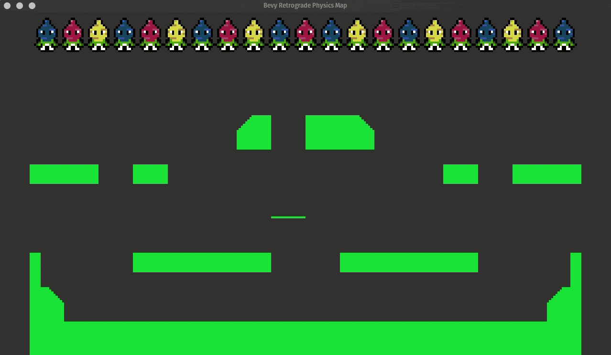

# Bevy Retrograde Examples

## Running Examples

We use the [just] for automating our development tasks and the project `justfile` includes tasks for
running the examples for web or native:

```bash
# Run native example
just run-example audio # or any other example name

# Run web example
just run-example-web collisions

# If you are running a native example you can also just use cargo
# ( this will not work for web examples )
cargo run --example ui
```

When running the web examples it will try to use [`basic-http-server`] to host the example on port
http://localhost:4000. You can install [`basic-http-server`] or you can modify the justfile to use
whatever your favorite development http server is.

[just]: https://github.com/casey/just
[`basic-http-server`]: https://github.com/brson/basic-http-server

## Full List

### [hello_world]

A good intro into Bevy Retrograde that also shows how to use the hierarchy system.


[hello_world]: ./hello_world.rs

### [spritesheet]

An example of how to use animated sprite sheets.


[spritesheet]: ./spritesheet.rs

### [physics_character]

An example demonstrating how to use the physics system to create collision boxes from sprites and how to do simple character movement.


[physics_character]: ./physics_character.rs

### [physics_map]

An example demonstrating how to create collision shapes for an LDtk map. 



[physics_map]: ./physics_map.rs

### [text]

An example showing how to render text using BDF font files.

> **Note:** This example shows how to render text, _without_ using the UI system, by creating text entities. This doesn't allow you to do any sort of layout other than positioning the text in the scene like you would any sprite. See the UI example below to see how to use the UI system to render text.


[text]: ./text.rs

### [ldtk_map]

An example showing you how to load and display an LDtk map file.


[ldtk_map]: ./ldtk_map.rs

### [ui]

An example demonstrating the [RAUI] UI integration. It shows how to create UI elements that can resize with the screen and how to create theme-able buttons and interact with the ECS world from the UI.

[raui]: https://raui-labs.github.io/raui/


[ui]: ./ui.rs

### [audio]

An example demonstrating how to play sounds and play music on loop.

[audio]: ./audio.rs

### [post_processing]

An example demonstrating how to add post-processing, using either the built-in CRT or your own custom shaders.


[post_processing]: ./post_processing.rs

### [custom_rendering]

An advanced example that shows how to do fully custom rendering of your own objects. This utilizes
raw calls to the [Luminance] graphics API allowing you to render _any_ kind of object, even 3D if you wanted to.


[luminance]: https://github.com/phaazon/luminance-rs
[custom_rendering]: ./custom_rendering.rs

### [radishmark]

A bunnymark style benchmark that also demonstrates how to use the UI system to render frames-per-second diagnostics.


[radishmark]: ./radishmark.rs
